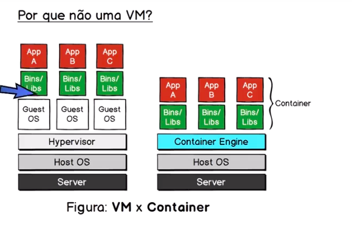
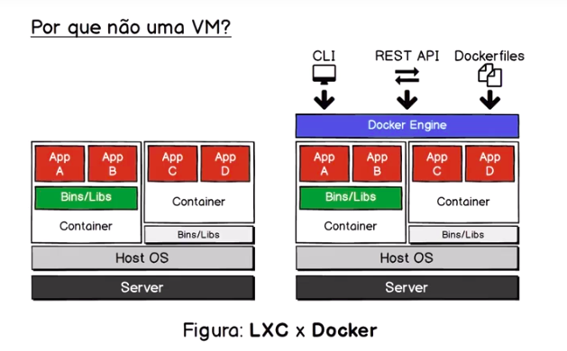
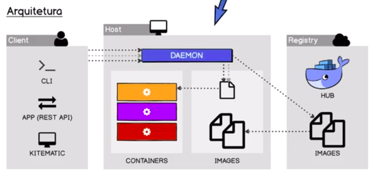
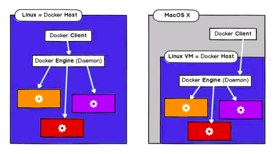
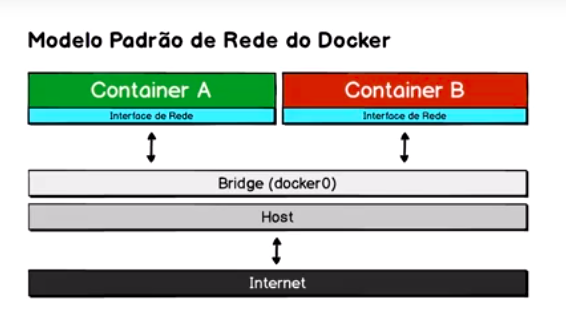
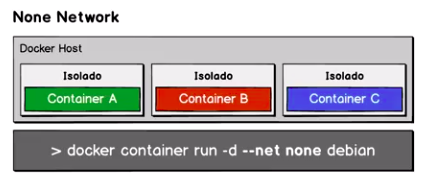

<a href="https://www.udemy.com/curso-docker/" target="_blank">Link do Curso</a>

<a href="https://github.com/cod3rcursos/curso-docker" target="_blank">Link do Repositório do Curso</a>

----------------------------------------------------------------------
<h1>Seção 02 - Conceitos</h1>

<h2>O que é Docker?</h2>

* É uma tecnologia de virtualização, mas não é um sistema de virutalização tradicional, baseado em máquinas virtuais.

* O docker é uma engine de administração de containers.

* O container é um ambiente isolado, mas que utiliza o mesmo kernel do sistema e vários recursos são compartilhados. Os containers possuem necessidade de memória e processamento muito menor do que uma máquina virtual, além de ser inicializado rapidamente.

* Utiliza os SErviços do LXC (Linux COntainers).

* Open Source e desenvolvida na linguagem GO.

* Sistema de VIrtualização Baseado em Software (SO).

* Host e Container compartilham o Kernel, como outras bibliotecas também.

* Empacota Software com vários níveis de Isolamento. Quantidade de memória, processamento, rede, endereço e etc.

<h2>Por que não uma VM?</h2>

* Start do container é muito mais rápida que uma VM.

* Quantidade de memória e processamento muiot menor que uma VM.

* Manter mesma vantagens da VM e consumo muito menor.




* A tecnologia LXC para criar containers já existia a muito tempo, a dificuldade era que precisava ter um conhecimento muito profundo para conseguir gerenciar esses containers, o docker veio para facilitar essa utilização.


<h2>O que são containers?</h2>

* Segregação de processos no mesmo Kernel (Isolamento).

* Sistemas de arquivos criados a partir de uma imagem.

* Ambientes leve e portáteis no qual aplicações são executadas.

* Encapsula todos os binários e bibliotecas necessárias para execução de uma App.

* Algo entre o chroot (redefine uma pasta raiz e aprisiona o processo dentro desse diretório) e uma VM.

* Ser o mais minimalista possível. Executar um container para apenas uma aplicação. É um bom padrão.

<h2>O que são imagens Docker?</h2>

* Modelo de sistema de arquivo somente-leitura usado para criar containers.

* Imagens são criadas através de um processo chamado build. Existe também o commit, mas não é uma boa prática utilizar. O build tem um descritor.

* São armazenados em repositórios no Registry. DockerHub, repositórios oficiais do Docker.

* São compostas por uma ou mais camadas (layers).

* Uma camada repsenta uma ou mais mudanças no sistema de arquivo.

* A junção dessas camadas formam a imagem.

* Apenas a última cmada pode ser alterada quando o container for iniciado.

* AUFS (Advanced multi-layered unification filesystem) é muito usado.

* O grande objetivo dessa estratégia de dividir uma imagem em camadas é o reuso.

* É possível compor imagens a partir de camdas de outras imagens.


<h2>Imagem vs Container</h2>

* Orientação Objeto:
	* Classe = Imagem - Modelo.
	* Objeto = Container - Processo usada na memória.

<h2>Arquitetura</h2>



---------------------------------------------------------------------------
<h1>Seção 03 - Instalação</h1>

<h2>Visão Geral</h2>



* Verificar instalação pela documentação do Docker.

* Docker CE - Community Edition.


---------------------------------------------------------------------------

<h1>Seção 04 - Uso Básico do Docker</h1>

<h2>Hello World</h2>

* Comando: docker --help

* Comando: docker container run hello-world

<h2>Comando run</h2>

* Versão nova dos comandos.

* A partir do comando run a gente baixou uma imagem, executamos o container e o container foi mostrado.

* Foi feito o cache da imagem.

* Executar o container de forma interativa.

* Comando run é a concatenação de 4 comandos:
	* docker image pull - baixar a imagem do registry para a máquina local.
	* docker container create - Criação do container.
	* docker container start - Inicialização do container.
	* docker container exec - Execução do container em modo interativo.

<h2>Ferramentas diferentes</h2>

* Modo interativo - Para experimentos - Não é o modo prioritário. O modo prioritário é o modo daemon.

* Comando: bash --version

* docker container run debian bash --version

* docker container ps - Mostra os containers em execução

* docker container ps -a - Mostra os todos os containers independente dos status.

* Ele executa o comando e depois fecha o container.

* docker container run --rm debian - Quando terminar o processo removera da lista de containers.

<h2>Run cria sempre novos containers</h2>

* O comando run sempre cria novos containers.

* docker container run -it debian bash (modo interativo e acesso ao terminal)

* Dentro do terminal do container
	* touch curso-docker.txt
	* ls curso-docker.txt
	* exit

* Executa o docker container run it debian bash (de novo) e da um ls curso-docker.txt. Não existirá

<h2>Containers devem ter nomes únicos</h2>

* docker container run --help

* docker container run --name mydev -it debian bash

* Saia do container (exit)

* Execute novamente o comando docker container run --name mydev -it debian bash

* Vai ocorrer um erro, pois já existe o mesmo nome.

* containers precisam ter nomes únicos e o método run sempre cria um novo container.

<h2>Reutilizar containers</h2>

* docker container ls //lista os containers que foram criados

* docker container ls -a //mostra todos independentemente dos status

* docker container start -ai mydeb //apache e modo interativo

* touch curso-docker.txt //CRIA ARQUIVO NO CONTAINER

* Sair e entrar novamente e verificar que o arquivo ainda existe. O arquivo ainda continuara lá.

<h2>Cedo, surdo e mudo, só que não</h2>

* Não faz sentido ter um container completamente isolado.

* Capaz de expor uma porta dentro do container.

* Compartilhar uma pasta do container para a máquina host.

* Compartilha arquivos do container para a máquina host e vice-versa.

* Comunicação entre os próprios containers e todos conversando entre si.

* Um container que não tem um minimo de comunicação não tem sentido.

* Isolamento controlado. Minimalista.

<h2>Mapear portas dos containers</h2>

* docker container run -p 8080:80 nginx //De fora do container irá acessar a 8080 e o serviço dentro está na porta 80.

* É possível acessar o localhost:8080 e acessará o nginx que está na porta 80.

<h2>Mapear diretórios para o container</h2>

* Criar um diretório na máquina host

* mkdir curso-docker

* cd curso-docker

* mkdir ex-volume

* cd ..

* code .

* docker container run -p 8080:80 -v $(pwd)/not-found:/usr/share/nginx/html //-v mapeia o volume passa a pasta do host que você quer mapear : a pasta que você quer dentro do container


<h2>Rodar um servidor web em background</h2>

* Modo daemon //MODO BACKGROUND

* Modo princípal para o Docker.

* docker container run -d --name ex-daemon-basic -p 8080:80 -v $(pwd)/html:/usr/share/nginx/html nginx //-d daemon

* Retornará o ID do container que estará executando

* docker container ps

* docker container stop ex-daemon-basic //PARA O CONTAINER

<h2>Gerenciar o container em background</h2>

* docker container stop ex-daemon-basic

* docker container start ex-daemon-basic

* docker container restart ex-daemon-basic

* É possível que ao inves de pegar o nome do container, é possível pegar o id do container.

<h2>Manipulação de containers em modo daemon</h2>

* Comandos alias.

* docker container ls //SINTAXE NOVA

* docker container list //SINTAXE NOVA

* docker container ps //SINTAXE NOVA

* docker ps //SINTAXE ANTIGA

* docker container ls -a //TODOS CONTAINERS

* docker container list -a //MESMO DE CIMA

* docker container ps -a //MESMA COISA

* docker ps -a //ANTIGO

* docker container start NOME_CONTAINER

* docker container inspect NOME_CONTAINER // FORMATO JSON VARIAS CARACTERÍSTCAS QUE SE BASEIA O CONTAINER

* docker container exec NOME_CONTAINER uname -or //TIPO QUE ESTÁ SENDO EXECUTADO NO CONTAINER

<h2>Nova sintaxe do Docker Client</h2>

* Comando semelhantes que fazem as mesmas coisas. Fizeram isso para deixar mais claro.

* docker image ls //LISTA AS IMAGENS

* docker container ls //LISTA CONTAINERS

* docker rmi ID_IMAGEM //SINTAXE ANTIGA //REMOVE IMAGEM

* docker image rm ID_IMAGEM //SINTAXE NOVA

------------------------------------------------------------------------
<h1>Seção 05 - Deixando de ser apenas um usuário</h1>

<h2>Introdução</h2>

* Definir própria imagem

* Ter varios ambientes (testes, produção, homologação)

* Ter várias configurações, etc.

* Personalizar imagens que estão públicas para adaptar a sua necessidade.

<h2>Diferença entre container e imagem</h2>

* Imagem -> Classe

* Container -> Objeto

* Imagem um agregado de camadas.

* Container é o processo e a imagem é o modelo de arquivos.

* docker container --help //MOSTRA TUDO O QUE TUDO PODE SER FEITO COM O COMANDO CONTAINER

* docker image --help //MOSTRA TUDO O QUE TUDO PODE SER FEITO COM O COMANDO IMAGE

<h2>Entendo melhor as imagens</h2>

* docker image pull redis:latest //BAIXA A IMAGEM DO REPOSITÓRIO

* docker image ls //LISTA TODOS AS IMAGENS

* docker image inspect redis:latest // INSPECIONA A IMAGEM

* docker image tag redis:latest cod3r-redis //CRIA UMA NOVA TAG PARA A IMAGEM

* docker image rm redis:latest //IRÁ EXCLUIR AS IMAGENS

* Várias tags que acompanham a mesma hash.

* Não é bom pegar a ultima versão, por conta da instabilidade, sendo possível quebrar alguma funcionalidade.

* Quando tiver trabalhando com ambiente de produção e de desenvolvimento as versões devem ser iguais, sendo a melhor prática.

* Amarrar a versão das aplicações, de forma manual.

<h2>Comandos básicos no gerenciamento de imagens</h2>

* 7 comandos para gerenciamento de imagens.

* Todos comandos começam com docker image.

* docker imagem pull //PUXA A IMAGEM DO DOCKERHUB - ACONTECE DE FORMA IMPLICITA NO run (docker image run).

* docker image ls //LISTA AS IMAGENS NA MÁQUINA HSOT

* docker imagem rm NOME_DA_TAG OU HASH //EXCLUI A IMAGEM

* docker image inspect //MOSTRA AS INFORMAÇÕES DA IMAGEM

* docker image tag IMAGEM_DE_ORIGEM TAG_QUE_VOCE_QUER_COLOCAR //CRIA UMA TAG DE UMA IMAGEM EXISTENTE

* docker image build //INTERPRETA O ARQUIVO E CONTRÓI SUA IMAGEM

* docker composer //TRABALHAR COM VÁRIOS AMBIENTES JUNTOS

* docker image push //PUBLICA NO REGISTRY LOCAL OU NO DOCKERHUB

* docker image build //COMANDO FUNDAMENTAL

<h2>Docker Hub x Docker Registry</h2>

* Serviço server side para serviços e repositório de imagens - Docker Registry.

* Docker Hub - SaaS (Software as a Service) - Ele possui o Docker Registry.

* Docker Hub tem imagens oficiais que mantem pelo time do próprio docker. 

* De prioridade do Docker Hub para imagens oficiais.

* Possível criar um Docker Registry particular (para sua empresa, por exemplo).

<h2>Meu primeiro build</h2>

* Criar um arquivo com a nomeclatura "Dockerfile"

* Escrever os seguintes comandos nele 

* FROM nginx:latest
* RUN echo '<h1><Hello World!</h1>' > /usr/share/nginx/html/index.html

* Após executar o comando:

* docker image build -t ex-simple-build . //FAZ O BUILD E DA O NOME PARA ELE DE ex-simple-build E O . SIGNIFICA QUE FARÁ UM BUILD.

* docker container run -p 80:80 ex-simple-build

* O nome precisa ser exatamente Dockerfile, se não ocorrerá um erro.

<h2>Uso das instruções de preparação</h2>

* Criação de um Dockerfile que será passado parâmetros no momento em que fizer o build.

* FROM debian
* LABEL maintainer 'Gustavo'
* ARG S3_BUCKET=files //S3_BUCKET É UMA ÁREA DA AMAZON QUE PEGA ARQUIVO, MAS É APENAS UM EXEMPLO FICTICIO
* ENV S3_BUCKET=${S3_BUCKET}

* Cada comando é um layer (camada)

* Depois executar 

* docker image build -t ex-build-arg .

* docker container run ex-build-arg bash -c 'echo $S3_BUCKET'

* docker image build --build-arg S3_BUCKET=myapp -t ex-build-arg . //GERA A IMAGEM MUDANDO O PARÂMETRO

* docker image inspect --format="{{}index .Config.Labels \"maintainer\"}" NOME_DA_IMAGEM //PESQUISA DENTRO DE INSPECTS


<h2>Uso das instruções de povoamento</h2>

* Arquivos que estão da sua máquina host para seu container.

* FROM nginx:latest
* LABEL maintainer 'Gustavo'
* RUN echo '<h1>Sem conteudo</h1>' > /usr/share/nginx/html/conteudo.html
* COPY *.html /usr/share/nginx/html //VAI COPIAR TUDO QUE FOR .html PARA A PASTA HTML DO CONTAINER

* docker image build -t ex-build-copy .

* docker container run -p 80:80 ex-build-copy

<h2>Uso das instruções para execução do container</h2>

* Criar a nova pasta que chama build-dev

* Cria um index.html

* Cria um servidor python 

```py
import logging
import http.server
import socketserver
import getpass

class MyHTTPHandler(http.server.SimpleHTTPRequestHandler):
    def log_message(self, format, *args):
            logging.info("%s - - [%s] %s\n"% (
                self.client_address[0],
                self.log_date_time_string(),
                format%args
            ))

logging.basicConfig(
    filename='/log/http-server.log',
    format='%(asctime)s - %(levelname)s - %(message)s',
    level=logging.INFO
)

logging.getLogger().addHandler(logging.StreamHandler())
logging.info('inicializando...')
PORT = 8000

httpd = socketserver.TCPServer(("",PORT), MyHTTPHandler)
logging.info('escutando a porta: %s', PORT)
logging.info('usuário: %s', getpass.getuser())
httpd.serve_forever()

```

* Concatenas varias layers com o comando RUN no arquivo Dockerfile.

* FROM python:3.6
* LABEL maintainer 'Gustavo'
* RUN useradd www && \
	* mkdir /app && \
	* mkdir /log && \
	* chown www /log

* USER www
* VOLUME /log
* WORKDIR /app
* EXPOSE 8000

* ENTRYPOINT ["/usr/local/bin/python"]
* CMD ["run.py"]

* docker image build -t ex-build-dev .

* docker container run -it -v $(pwd):/app -p 80:8080 --name python-server ex.build-dev //-v É O VOLUME QUE FOI SETADO NO Dockerfile

* docker container run -it --volumes-from=python-server debian cat /log/http-server.log

<h2>Eviar Imagens para o DockerHub</h2>

* Criar conta

* docker image ls

* Criar nova tag utilizando o usuário do DockerHub

* docker image tag ex-simple-build gustavoprimolan/simple-build:1.0

* docker login --username=gustavoprimolan

* colocar senha

* docker image push NOME_DA_IMAGEM (gustavoprimolan/simple-build:1.0)

-----------------------------------------------------------------------------
<h1>Seção 06 - Redes</h1>

<h2>Visão Geral e Tipos de Redes</h2>

* Modelo padrão do Docker utiliza o tipo Bridge.



* Docker suporta 4 tipos de redes, mas será concentrado em 3 deles.

* Tipos de Redes
	* None Network
	* Bridge Network (Padrão) - Imagem
	* Host Network - Tira a camada Bridge
	* Overlay Network (Swarm) - Fazer cluster

* docker network ls //LISTA AS REDES

<h2>Rede Tipo None (Sem Rede)</h2>




